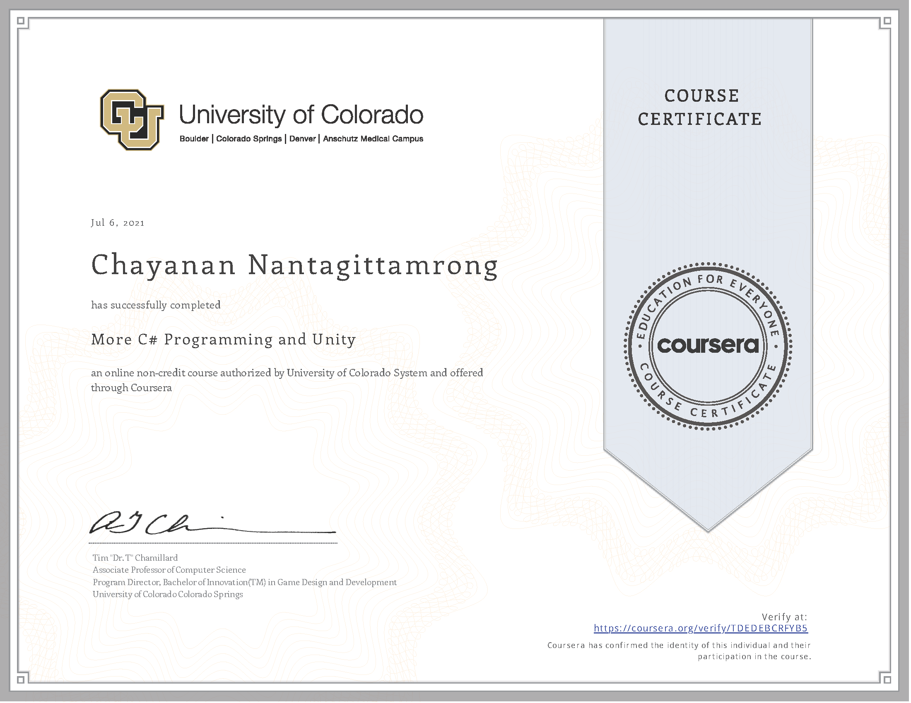

## 👋🏼 [𝑾𝒆𝒍𝒄𝒐𝒎𝒆 𝒕𝒐 𝒎𝒚 𝒑𝒓𝒐𝒇𝒊𝒍𝒆](https://chayanandnantagitt.wixsite.com/l3allil2on?fbclid=IwAR152EpgQbEdhkKdLVKxMXuP0o4zFXCqhIKrRUXF1Vj7EbsZXRIsMxquhOc)

🧑🏻💬 Hi, My name's Chayanan, I'm from Thailand, 👁‍🗨 I'm interested in programming and cybersecurity.  
  This is my 
  <a href="https://github.com/l3allil2onz/chayanan-portfolio"> 
    Cybersecurity Portfolio 
  </a>

  

  
  
  

---

### :sparkles: 𝑷𝒓𝒐𝒋𝒆𝒄𝒕𝒔

  
  
  
  
  
  
  
  
  
  
  
  
  

---

### :books: 𝑪𝒆𝒓𝒕𝒊𝒇𝒊𝒄𝒂𝒕𝒆𝒔

   
   
   
   
   
   
   

<!---
l3allil2onz/l3allil2onz is a ✨ special ✨ repository because its `README.md` (this file) appears on your GitHub profile.
You can click the Preview link to take a look at your changes.
--->
